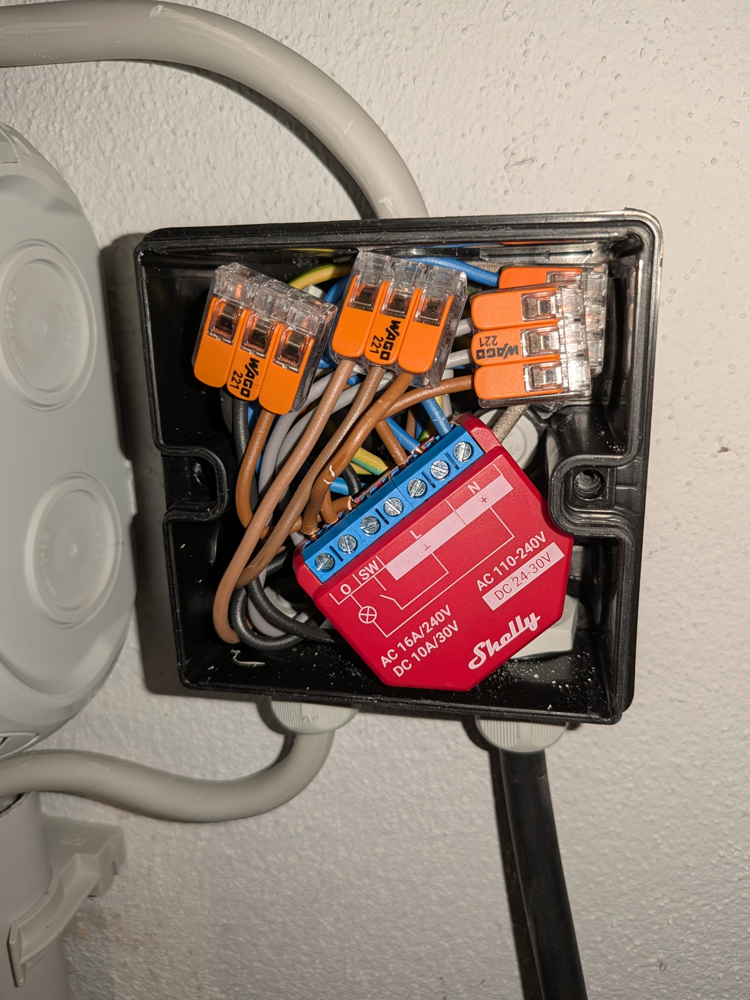
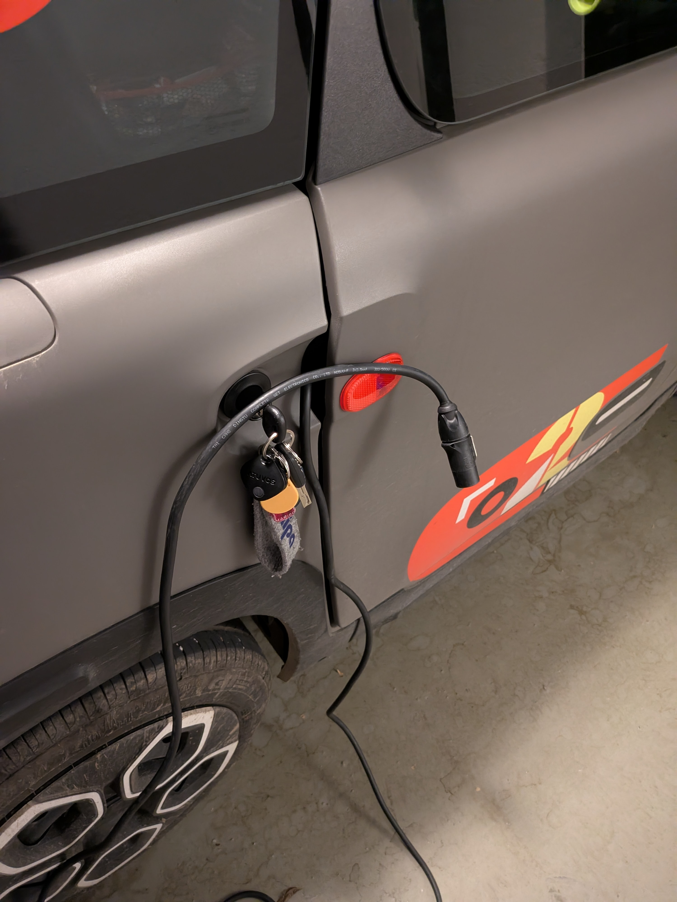
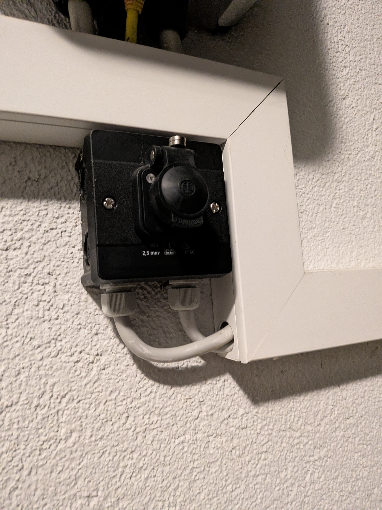
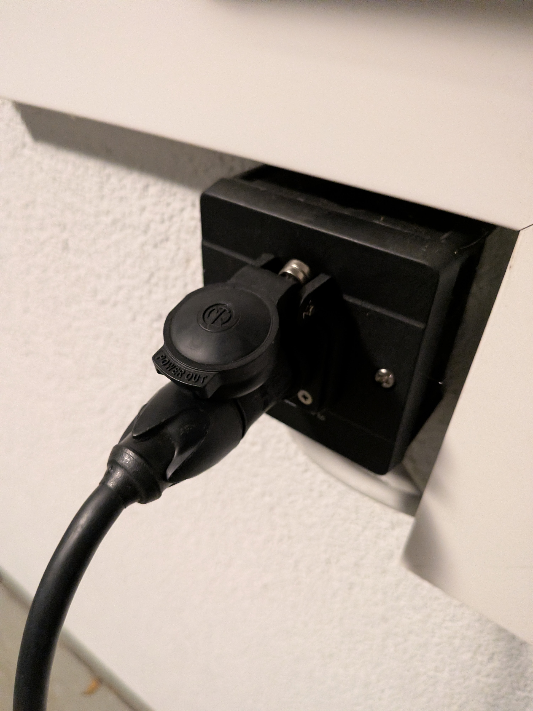
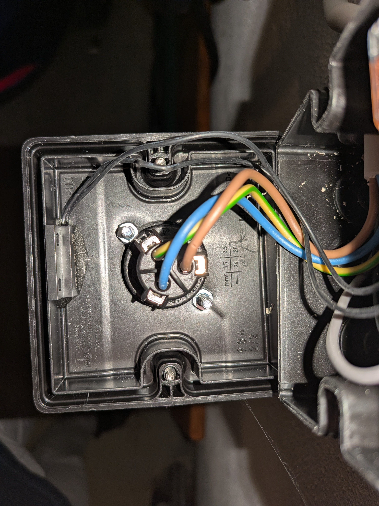
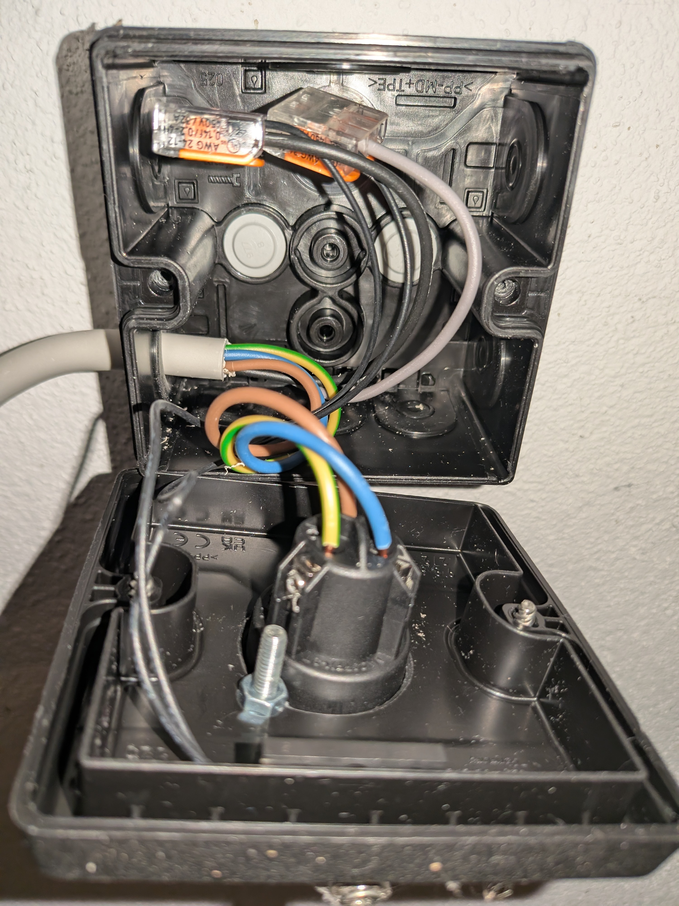
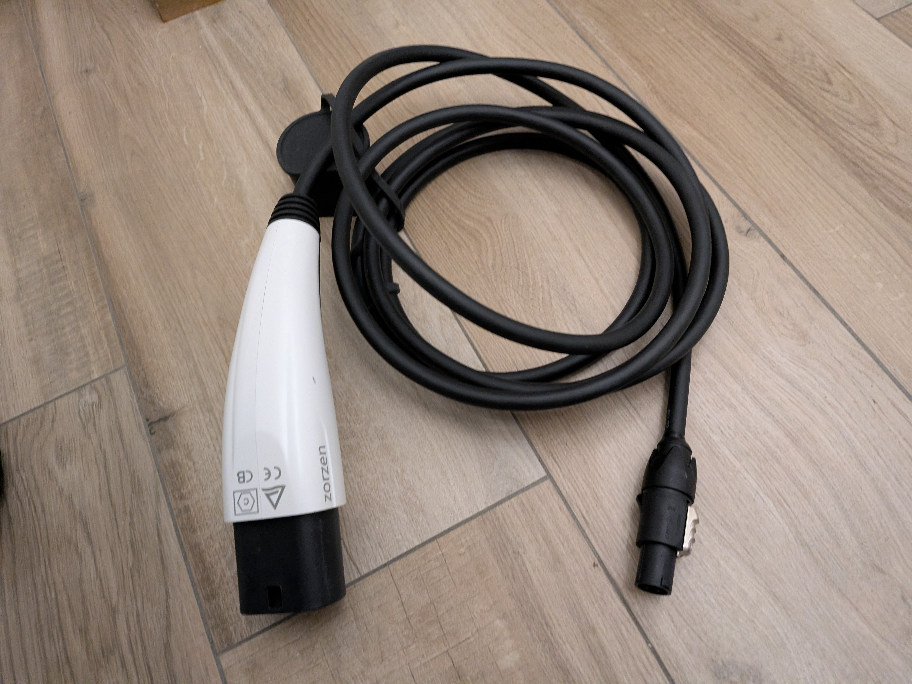
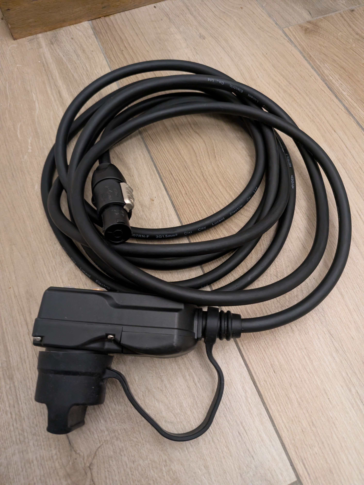
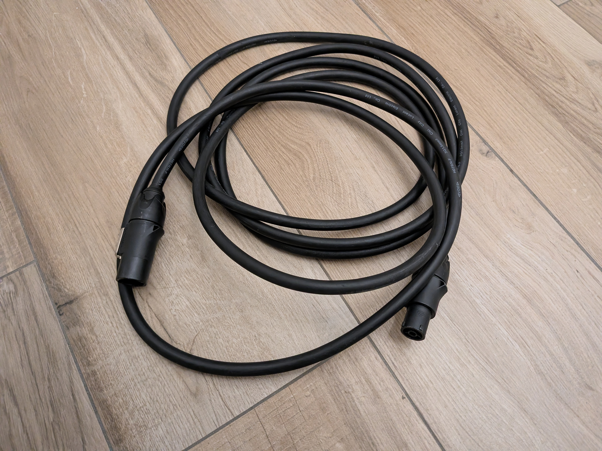

# Bildergalerie: Hardware-Aufbau

Hier sind die Detailbilder des Hardware-Setups, wie es in der `README.md` beschrieben ist.

### Einspeisung und Shelly
Den Shelly in einer Dose mit Einspeisung sieht man hier:

### Modifiziertes Kabel am AMI
Das modifizierte Kabel am AMI:

### "Wallbox" (Ladedose) - Geschlossen
Die Ladedose ander Wand "Wallbox" im geschlossenen Zustand, man sieht hier schön die Magnete und den Stecker:

### "Wallbox" (Ladedose) - Geöffnet
Die Dose im geöffneten Zustand, man sieht die Verkabelung und den Einbau des Reed Kontaktes mit 2-Komponenten-Kleber am Deckel-Rand:

### Zusätzliche Ladekabel
Die drei beschriebenen zusätzlichen Kabel:

