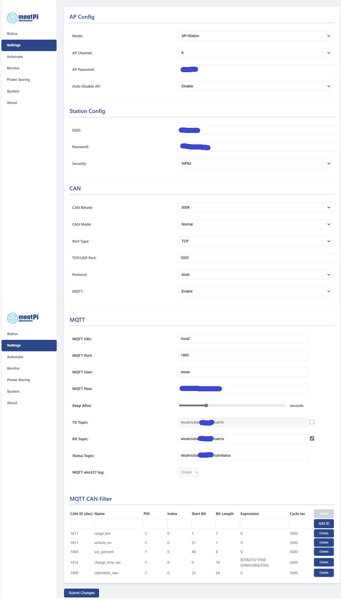
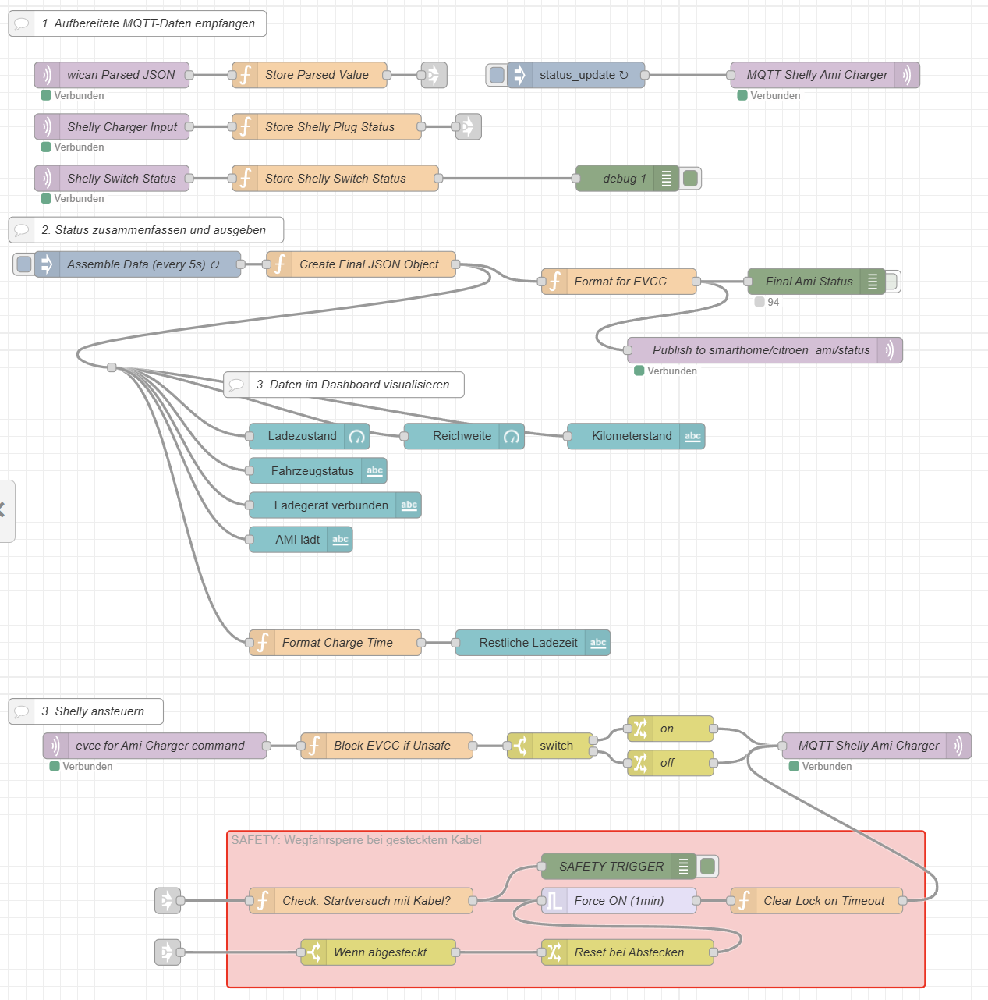
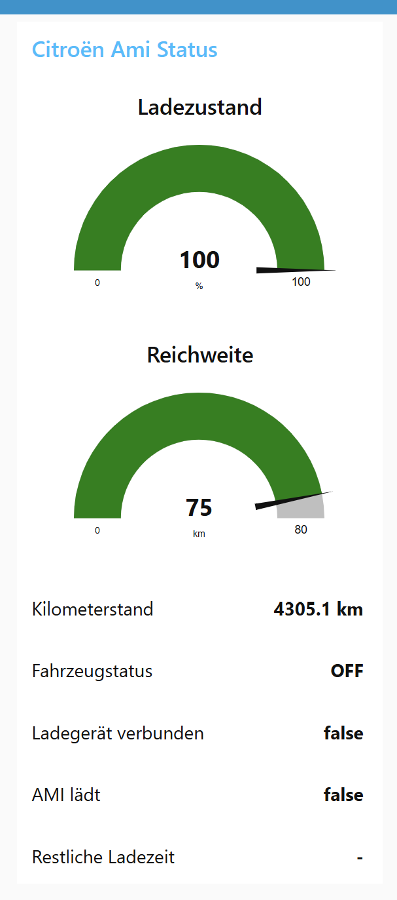

# Citroen-AMI-evcc-Connector
Dieses Projekt beschreibt die vollständige Integration eines Citroën Ami (oder baugleichen Opel Rocks-e / FIAT Topolino) in EVCC zur Steuerung des PV-Überschussladens.

## Citroën Ami / Opel Rocks-e / FIAT Topolino EVCC Integration (mit WiCAN & Shelly)

Die Lösung basiert auf einem **WiCAN OBD-Modul** zum Auslesen der Fahrzeugdaten und einem **Shelly 1PM** (oder einem ähnlichen schalt- und messbaren Aktor mit Eingang für Kontakt) zur Steuerung des Ladegerätes. Die gesamte Logik wird in **Node-RED** zusammengeführt.

## Übersicht der Architektur

1. **WiCAN-Modul:** Hängt am OBD-Port, liest den CAN-Bus, parst die Rohdaten (SoC, Reichweite, Status etc.) vor und sendet sie per MQTT an einen Broker.

2. **Shelly 1PM:** Misst die Ladeleistung (W) und den Status des Ladeziegels (Stecker eingesteckt?). Er wird von EVCC per MQTT geschaltet (`on`/`off`).

3. **Node-RED:** Dient als zentrale Logik-Einheit.

   * Empfängt die Fahrzeugdaten vom WiCAN.

   * Empfängt die Stecker-Daten vom Shelly.

   * Behebt das Byte-Reihenfolge-Problem des Kilometerstands.

   * Implementiert Timeouts für veraltete Fahrzeugdaten (wenn das Auto offline geht).

   * Pollt den Shelly-Status aktiv, um `outdated`-Fehler in EVCC zu vermeiden.

   * Erstellt ein sauberes JSON-Objekt (`smarthome/citroen_ami/status`), das den kombinierten Status für EVCC bereitstellt.

4. **EVCC:**

   * Definiert den Shelly als "Wallbox" (Charger).

   * Definiert den Ami als "Fahrzeug" (Vehicle), das seine Daten vom Node-RED-Flow bezieht.

   * Der Ladepunkt (Loadpoint) verknüpft beide und steuert das Überschussladen.
  
5. **Hardware:**

* WiCAN OBD Adapter. Falls Ihr den AMI-Bluetooth-Dongle behalten wollt: Dann zusätzlich einen OBD-Doppelstecker, funktioniert prima parallel (sofern man beim Citrone Dongle/App gedöns von prima reden kann). Ich hab sogar einen Dreifachstecker genommen, da ich mir von der OBD Buchse noch den 12V-Dauerplus für meine Dashcam gezogen habe.

* Shelly 1 PM oder ähnlich um den Lader ein- oder auszuschalten.

* Der FI Schalter am AMI muss durch einen Stecker ersetzt werden, da der FI beim Abschalten der Spannung ausschaltet. Ich habe hier anstelle des FI einen powerCON TRUE1 Stecker angebracht. Dem FI habe ich ein neues Kabel spendiert und an die gegenseite eine powerCON TRUE1 Kupplung angebracht. Dadurch kann man damit weiterhin an einer Schuko Steckdose laden. Zudem habe ich einen Mode2 auf Schuko Adapter besorgt. Auch hier habe ich die True1-Kupplung anstelle der Schuko-Kupplung angebaut - jetzt kann man auch an einer Ladestation laden (Kabel immer schön ins Auto einklemmen, es gibt so keinen Diebstahl-Schutz). Die TRUE1-Serie ist im gesteckten Zustand Outdoor-geeignet und sie dürfen unter Last gesteckt/getrennt werden (aber niemals offen draußen rumliegen lassen, Schmutz und Wasser haben im Stecker nichts zu suchen!). Daher sind sie ideal geeignet. Zudem hab ich mir noch ein PowerCon-Verlängerungskabel aus den beiden Reserve-Steckern und einem Stück Verlängerungskabel gebaut.

* Die "Wallbox" ist nun eine PowerCon-Einbau-Kupplung mit Klappdeckel in einer Abox Abzweigdose. An den Klappdeckel habe ich zwei kleine Magneten angebracht: Wenn der Klappdeckel offen ist, betätigt er einen 230V-tauglichen Reed-Kontakt (PIC MS-324-5 Reed-Kontakt 1 Schließer), der wiederrum dem Shelly das "gesteckt" Signal schickt. Ich habe drei von diesen Boxen gebaut und in Reihe geschaltet. Der Shelly samt Einspeisung ist ein einer AP-Abzweigdose eingebaut. Von dort geht ein 5x1,5er Kabel zu allen drei Boxen (jeweils durchgeschleift). Neben PE und N liegt dort 1x Phase geschaltet vom Shelly für die Powercon Steckdosen. Dann einmal Phase dauer für die Reed Kontakte und natürlich alle drei Reed Kontakt parallel zurück auf der dritten Ader für den Shelly an dessen Eingang. Die Verknüpfung vom Eingang mit dem Ausgang im Shelly habe ich belassen: Bei einem Ausfall der Logik läd das ganze trotzdem einfach. EVCC erkennt dass der Shelly dadurch eingeschaltet wird und schaltet ihn gleich wieder aus. Das hat auch den Vorteil, dass das WiCAN in Ruhe ein bisschen senden kann und so der aktuelle Ladezustand da ist.

* AP-Dose(n), Verschaubung mit Zugentlastung für die Einspeisung, ggfs. Würgenippel für fest installiertes Kabel.

* 10m Gummi-Verlängerungskabel (Den Stecker mit ein bisschen Kabel dran abschneiden un direkt als Einspeisung für das Ganze genommen, den Rest halbiert, einmal als Verlängerung und eimal als Ladekabel).


Fotos von dem ganzen findet ihr im Ordner images hier im Repository: [Ladestecker-Bilder](images/)

**DISCLAIMER:**
Bitte beachtet, dass ich Fachkraft bin und sowas bauen darf. Ihr müsst Euch bitte unbedingt an die gültigen Vorschriften halten. Nutzt Adern-Endhülsen wo nötig. Nutzt transparente WAGOS und nutzt deren transparentes Gehäuse um die ordentliche Montage zu kontrollieren. Messt am Ende alles sauber durch und macht eine Isolationmessung. Die ganze Installation muss unbedingt an einem FI angeschlossen sein, wenn ihr nicht wieder den FI vom AMI zur Einspeisung nutzt (oder einen gelichwertigen). Zudem nutzt bitte keinesfalls einen normalen Schuko Stecker anstelle der PowerCon-Stecker am AMI. So vermeidet ihr, dass jemand das Auto mal an einer Steckdose ohne FI lädt. Daher habe ich ja auch das Ladekabel aus dem alten FI gefertigt, damit man es damit wieder bedenkenlos an jeder Steckdose laden kann. **Ich übernehme keinerlei Haftung für das ganze und garantiere auch nicht das Prinzip des ganzen. Bitte sucht Euch einen Elektriker, wenn ihr nicht selbst dafür qualifiziert seid.**

**Material-Liste:**

|Anzahl|Bestellnummern-Beispiel|Bezeichnung|
|:---|:---|:---|
|1 Stück|Conrad 1384363|VERLÄNGERUNGSKABEL 10 M IP44|
|4 Stück|Conrad 3062232|Abzweigkasten Abox 025-L/sw|
|3 Stück|Conrad 503530|FLACHGEH. REEDSENSOR PIC MS-324-5|
|3 Stück|Conrad 1970190|Neutrik powerCON TRUE1 NAC3FX-W-TOP, verriegelbare 16A (lt VDE) / 20A (lt. UL) Steckverbindung, geschlossenes System|
|3 Stück|Thomann 453305|Neutrik powerCON TRUE1 NAC3MX-W-TOP, verriegelbare 16A (lt VDE) / 20A (lt. UL) Steckverbindung, geschlossenes System|
|3 Stück|Thomann 453314|Neutrik powerCON TRUE1 NAC3FPX-ST-TOP, Geräte Ausgangsbuchse, verriegelbare 16A (lt VDE) / 20A (lt. UL) Steckverbindung|
|3 Stück|Thomann 560874|Neutrik powerCON TRUE1 NSSC-2; gefederte Dichtklappe zum Schutz aller powerCON TRUE1 TOP female Einbaustecker; Schutzklasse IP65|
|3 Stück|Amazon B0CN1227BJ|Neodym Magnete mit Loch, Extra Stark 10mmx3mm|
|1 Stück|Amazon B0CYZ4QJG8|Adapter Mode2 nach Schuko|

## 1. Konfiguration des WiCAN-Moduls

Die folgende Konfiguration wird in der Weboberfläche des WiCAN-Moduls unter "CAN to JSON interpreter" eingetragen. Sie sorgt dafür, dass die CAN-Daten bereits auf dem Modul geparst und nur die relevanten Werte per MQTT gesendet werden. Ihr müsst das WICAN Modul natürlich auch ins WLAN einbinden oder ihm anderweitig ermöglichen Online zu kommen und Daten an Euren Broker zu senden.

**Wichtiger Hinweis:** Der Kilometerstand (`odometer_raw`) wird als Rohwert gesendet, da die Firmware des WiCAN-Moduls die nötige Byte-Swap-Berechnung nicht korrekt verarbeiten kann. Die Umrechnung erfolgt später in Node-RED.



**MQTT CAN Filter**

CAN ID (dec)|Name|PID|Index|Start Bit|Bit Length|Expression|Cycle MS
:---|:---|:---|:---|:---|:---|:---|:--
1811|range_km|-1|0|1|7|V|5000
1811|vehicle_on|-1|0|21|1|V|5000
1408|soc_percent|-1|0|40|8|V|5000
1410|charge_time_sec|-1|0|0|16|(((V&255)*256)\|((V&65280)/256))|5000
1409|odometer_raw|-1|0|32|24|V|5000

## 2. Konfiguration Node-RED

Der Node-RED-Flow ist das Herzstück der Logik. Er abonniert die WiCAN- und Shelly-MQTT-Topics und führt sie zusammen.

**Aufgaben des Flows:**

* Empfängt `wican/+/json` und speichert Werte (SoC, Reichweite, `vehicle_on` etc.) mit Zeitstempel.

* Empfängt `shellies/amicharger/status/input:0` und speichert den `state` (Stecker eingesteckt? `true`/`false`).

* Sendet alle 30s ein `update` an `shellies/amicharger/command`, um die EVCC "outdated"-Fehler zu beheben.

* Erstellt alle 5s ein finales JSON-Objekt:

  * Korrigiert den `odometer_raw` per JavaScript.

  * Prüft auf Timeouts für `vehicle_on` und `charge_time_sec` (setzen auf "OFF" / "nicht ladend" nach 60s ohne Daten).

  * Bestimmt den EVCC `charge_status` ('A', 'B', 'C').

  * Stellt ein Dashboard bereit.

* Sendet das finale Objekt an `smarthome/citroen_ami/status`.

* Konvertiert das ON-OFF Kommando von EVCC and den Shelly 

**Import:** Kopiere den Inhalt der Datei [citroen-ami-flow.json](citroen-ami-flow.json) und importiere ihn in Node-RED. Passe die MQTT-Broker-Einstellungen an.

**Flow:**



**Dashboard**



## 3. Konfiguration EVCC (`evcc.yaml`)

Füge die folgenden Abschnitte zu deiner `evcc.yaml`-Datei hinzu, um die virtuelle Wallbox (Shelly) und das Fahrzeug (Ami) zu definieren.

**Wichtige Voraussetzungen:**

* Der Shelly muss für MQTT konfiguriert sein und unter `shellies/amicharger/...` senden/empfangen.

* Node-RED muss wie oben konfiguriert sein und an `smarthome/citroen_ami/status` senden.

* Die EVCC-Config muss wie unten angepasst werden. Zudem müsst ihr in der EVCC GUI den Ladestrom auf 8A (MIN und MAX Wert) einstellen, da wir ja nicht regeln können, sondern nur schalten. 

```yaml
chargers:
- name: ami_charger
  type: custom
  status:
    source: mqtt
    topic: smarthome/citroen_ami/status
    jq: .charge_status # Dieses Feld wird jetzt in Node-RED intelligent kombiniert
  enable:
    source: mqtt
    topic: smarthome/amicharger/command
  enabled:
    source: mqtt
    topic: shellies/amicharger/status/switch:0
    jq: .output
  power:
    source: mqtt
    topic: shellies/amicharger/status/switch:0
    jq: .apower
  energy:
    source: mqtt
    topic: shellies/amicharger/status/switch:0
    jq: .aenergy.total / 1000
  currents:
    - source: mqtt
      topic: shellies/amicharger/status/switch:0
      jq: .current
    - source: const
      value: 0
    - source: const
      value: 0
  maxcurrent:
    source: mqtt
    topic: smarthome/amicharger/maxcurrent

vehicles:
 - name: ami
   type: custom
   title: Citroën Ami
   capacity: 5.5 # kWh Nennkapazität der Batterie
   soc:
     source: mqtt
     topic: smarthome/citroen_ami/status
     jq: .soc_percent
   status:
     source: mqtt
     topic: smarthome/citroen_ami/status
     jq: .charge_status # Dieses Feld wird jetzt in Node-RED intelligent kombiniert
   range:
     source: mqtt
     topic: smarthome/citroen_ami/status
     jq: .range_km
   odometer:
     source: mqtt
     topic: smarthome/citroen_ami/status
     jq: .odometer_km

loadpoints:
- title: Ami Lader
  charger: ami_charger # Name der oben definierten virtuellen Wallbox
  vehicle: ami       # Name des oben definierten Fahrzeugs
  mode: pv           # Standard-Lademodus (pv, minpv, now)
```

## Danksagung
Diese Integration wäre ohne die Vorarbeit aus dem [AMI-Display GitHub-Projekt](https://github.com/flrahe/AMI-Display) nicht möglich gewesen, das als Referenz für die CAN-IDs diente. Danke Euch!
